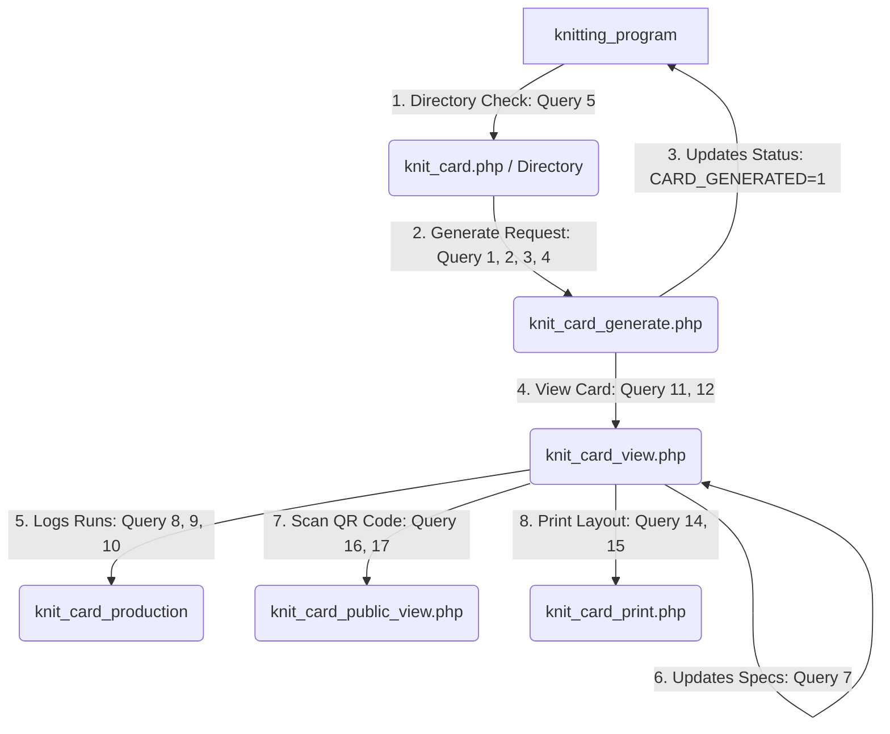

# Knit Card Module SQL Queries & Database Schema Documentation

This document contains a comprehensive analysis of all SQL queries, database schemas, foreign key relationships, and workflows related to the **Knit Card Module** within the Knitting Project.

---

## 1. Database Schema Definitions

### Table: `knit_card`
Stores metadata and technical specifications for generated Knit Cards.
* **Primary Key**: `KCID` (Integer, Auto Increment)
* **Foreign Keys**:
  * `KPTID` references `knitting_program(KPTID)` on `UPDATE CASCADE`

```sql
CREATE TABLE `knit_card` (
  `KCID` int(11) NOT NULL AUTO_INCREMENT,
  `KPTID` int(11) NOT NULL,
  `CARD_DATE` date NOT NULL,
  `MCNO` varchar(50) NOT NULL,
  `FINISH_DIA` varchar(20) DEFAULT NULL,
  `FINISH_GSM` varchar(20) DEFAULT NULL,
  `GREY_GSM` varchar(20) DEFAULT NULL,
  `SL_VDQ` decimal(5,2) DEFAULT NULL,
  `OPEN_TUBE` varchar(20) DEFAULT NULL,
  `BUYER` varchar(100) DEFAULT NULL,
  `SUPPLIER` varchar(100) DEFAULT NULL,
  `BOOKING` varchar(50) DEFAULT NULL,
  `SONO` varchar(50) DEFAULT NULL,
  `STYLE` varchar(100) DEFAULT NULL,
  `FABRICS_TYPE` varchar(100) DEFAULT NULL,
  `YARN_TYPE` varchar(100) DEFAULT NULL,
  `YARN_COUNT` varchar(50) DEFAULT NULL,
  `LOT_NO` varchar(150) DEFAULT NULL,
  `KNIT_M_DESCRIPTION` varchar(200) DEFAULT NULL,
  `REQ_QTY` decimal(12,3) DEFAULT 0.000,
  `PREPARED_BY` varchar(100) DEFAULT NULL,
  `AUTHORISED_BY` varchar(100) DEFAULT NULL,
  `CREATED_DATE` timestamp NOT NULL DEFAULT current_timestamp(),
  PRIMARY KEY (`KCID`),
  KEY `IDX_KPTID` (`KPTID`),
  CONSTRAINT `FK_knit_card_program` FOREIGN KEY (`KPTID`) REFERENCES `knitting_program` (`KPTID`) ON UPDATE CASCADE
) ENGINE=InnoDB DEFAULT CHARSET=utf8mb4 COLLATE=utf8mb4_general_ci;
```

---

### Table: `knit_card_production`
Stores daily shifting and production totals linked to specific Knit Cards.
* **Primary Key**: `KCPID` (Integer, Auto Increment)
* **Foreign Keys**:
  * `KCID` references `knit_card(KCID)` on `UPDATE CASCADE`
  * `OPERATOR_A` references `knitting_operator(OPERATOR_ID)` on `DELETE SET NULL` on `UPDATE CASCADE`
  * `OPERATOR_B` references `knitting_operator(OPERATOR_ID)` on `DELETE SET NULL` on `UPDATE CASCADE`
  * `OPERATOR_C` references `knitting_operator(OPERATOR_ID)` on `DELETE SET NULL` on `UPDATE CASCADE`

```sql
CREATE TABLE `knit_card_production` (
  `KCPID` int(11) NOT NULL AUTO_INCREMENT,
  `KCID` int(11) NOT NULL,
  `LOG_DATE` date NOT NULL,
  `A_SHIFT_QTY` decimal(10,2) DEFAULT 0.00,
  `B_SHIFT_QTY` decimal(10,2) DEFAULT 0.00,
  `C_SHIFT_QTY` decimal(10,2) DEFAULT 0.00,
  `PRODUCTION_QTY` decimal(10,2) NOT NULL DEFAULT 0.00,
  `CUM_TOTAL` decimal(12,2) NOT NULL DEFAULT 0.00,
  `BALANCE` decimal(12,2) NOT NULL DEFAULT 0.00,
  `OPERATOR_A` varchar(20) DEFAULT NULL,
  `OPERATOR_B` varchar(20) DEFAULT NULL,
  `OPERATOR_C` varchar(20) DEFAULT NULL,
  `CREATED_DATE` timestamp NOT NULL DEFAULT current_timestamp(),
  PRIMARY KEY (`KCPID`),
  KEY `IDX_KCID` (`KCID`),
  KEY `FK_kcp_operator_a` (`OPERATOR_A`),
  KEY `FK_kcp_operator_b` (`OPERATOR_B`),
  KEY `FK_kcp_operator_c` (`OPERATOR_C`),
  CONSTRAINT `FK_kcp_card` FOREIGN KEY (`KCID`) REFERENCES `knit_card` (`KCID`) ON UPDATE CASCADE,
  CONSTRAINT `FK_kcp_operator_a` FOREIGN KEY (`OPERATOR_A`) REFERENCES `knitting_operator` (`OPERATOR_ID`) ON DELETE SET NULL ON UPDATE CASCADE,
  CONSTRAINT `FK_kcp_operator_b` FOREIGN KEY (`OPERATOR_B`) REFERENCES `knitting_operator` (`OPERATOR_ID`) ON DELETE SET NULL ON UPDATE CASCADE,
  CONSTRAINT `FK_kcp_operator_c` FOREIGN KEY (`OPERATOR_C`) REFERENCES `knitting_operator` (`OPERATOR_ID`) ON DELETE SET NULL ON UPDATE CASCADE
) ENGINE=InnoDB DEFAULT CHARSET=utf8mb4 COLLATE=utf8mb4_general_ci;
```

---

## 2. Extraction of SQL Queries by File

### 2.1 File: `knit_card_generate.php`

#### Query 1: Check Existing Card
* **Line Number**: 18
* **Purpose**: Verifies if a Knit Card has already been generated for the target knitting program to prevent double creation.
* **SQL Query**:
  ```sql
  SELECT KCID FROM knit_card WHERE KPTID = ? LIMIT 1
  ```
* **Page/Function**: Initial page setup / pre-generation validation.

#### Query 2: Fetch Source Program Data
* **Line Number**: 32
* **Purpose**: Retrieves all metadata from the source knitting program using its primary key (`KPTID`) to map and clone it into the new card.
* **SQL Query**:
  ```sql
  SELECT * FROM knitting_program WHERE KPTID = ?
  ```
* **Page/Function**: Header retrieval logic.

#### Query 3: Create New Knit Card
* **Line Number**: 73–80
* **Purpose**: Inserts the newly generated card record populated with mapped program values.
* **SQL Query**:
  ```sql
  INSERT INTO knit_card (
      KPTID, CARD_DATE, MCNO, FINISH_DIA, FINISH_GSM, GREY_GSM, SL_VDQ,
      OPEN_TUBE, BUYER, SUPPLIER, BOOKING, SONO, STYLE,
      FABRICS_TYPE, YARN_TYPE, YARN_COUNT, LOT_NO, KNIT_M_DESCRIPTION,
      REQ_QTY, PREPARED_BY, AUTHORISED_BY
  ) VALUES (?, ?, ?, ?, ?, ?, ?, ?, ?, ?, ?, ?, ?, ?, ?, ?, ?, ?, ?, ?, ?)
  ```
* **Page/Function**: Card generation execution logic.

#### Query 4: Update Program Status
* **Line Number**: 117
* **Purpose**: Marks the source knitting program's status as `CARD_GENERATED = 1` in the database.
* **SQL Query**:
  ```sql
  UPDATE knitting_program SET CARD_GENERATED = 1 WHERE KPTID = ?
  ```
* **Page/Function**: Post-generation completion hook.

---

### 2.2 File: `knit_card.php`

#### Query 5: Directory Program Fetch with Joined Cards
* **Line Number**: 18–21
* **Purpose**: Fetches all knitting programs dynamically filtered by Buyer, Machine No, or Booking No, left joining the `knit_card` table to see if they have cards generated.
* **SQL Query**:
  ```sql
  SELECT kp.*, kc.KCID AS card_id
  FROM knitting_program kp
  LEFT JOIN knit_card kc ON kp.KPTID = kc.KPTID
  WHERE 1=1
    -- Dynamic filters:
    -- AND kp.BUYER LIKE ?
    -- AND kp.MCNO LIKE ?
    -- AND kp.BOOKING LIKE ?
  ORDER BY kp.KPTID DESC
  ```
* **Page/Function**: Main Directory Listing.

---

### 2.3 File: `knit_card_list.php`

#### Query 6: List Existing Cards
* **Line Number**: 16–19
* **Purpose**: Fetches all generated cards left-joined with booking details from the source program, applying filters.
* **SQL Query**:
  ```sql
  SELECT kc.*, kp.BOOKING AS kp_booking
  FROM knit_card kc
  LEFT JOIN knitting_program kp ON kc.KPTID = kp.KPTID
  WHERE 1=1
    -- Dynamic filters:
    -- AND kc.BUYER LIKE ?
    -- AND kc.MCNO LIKE ?
    -- AND kc.CARD_DATE >= ?
    -- AND kc.CARD_DATE <= ?
  ORDER BY kc.KCID DESC
  ```
* **Page/Function**: Knit Cards List viewer.

---

### 2.4 File: `knit_card_view.php`

#### Query 7: Update Card Header Specifications
* **Line Number**: 44–50
* **Purpose**: Commits administrative edits made to the header specifications of an existing card.
* **SQL Query**:
  ```sql
  UPDATE knit_card SET
      MCNO=?, FINISH_DIA=?, FINISH_GSM=?, GREY_GSM=?, SL_VDQ=?,
      OPEN_TUBE=?, BUYER=?, BOOKING=?, SONO=?, STYLE=?,
      FABRICS_TYPE=?, YARN_TYPE=?, YARN_COUNT=?, LOT_NO=?,
      KNIT_M_DESCRIPTION=?, REQ_QTY=?, PREPARED_BY=?, AUTHORISED_BY=?
  WHERE KCID=?
  ```
* **Page/Function**: Header edit submission handler (`update_header`).

#### Query 8: Fetch Required Quantity
* **Line Number**: 89
* **Purpose**: Gets the total target quantity of a card to recalculate balances during production log entries.
* **SQL Query**:
  ```sql
  SELECT REQ_QTY FROM knit_card WHERE KCID = ?
  ```
* **Page/Function**: Production log calculator.

#### Query 9: Fetch Last Cumulative Total
* **Line Number**: 97
* **Purpose**: Retrieves the most recent cumulative production quantity for the card.
* **SQL Query**:
  ```sql
  SELECT CUM_TOTAL FROM knit_card_production WHERE KCID = ? ORDER BY LOG_DATE DESC, KCPID DESC LIMIT 1
  ```
* **Page/Function**: Production log calculator.

#### Query 10: Log Production Shift Entry
* **Line Number**: 112–115
* **Purpose**: Inserts a daily shifting production record for the target card.
* **SQL Query**:
  ```sql
  INSERT INTO knit_card_production
      (KCID, LOG_DATE, A_SHIFT_QTY, B_SHIFT_QTY, C_SHIFT_QTY, PRODUCTION_QTY, CUM_TOTAL, BALANCE, OPERATOR_A, OPERATOR_B, OPERATOR_C)
  VALUES (?, ?, ?, ?, ?, ?, ?, ?, ?, ?, ?)
  ```
* **Page/Function**: Production logger submission handler (`add_production_log`).

#### Query 11: Get Card Header for Viewer
* **Line Number**: 135
* **Purpose**: Fetches details for a single card with the booking info joined from the program.
* **SQL Query**:
  ```sql
  SELECT kc.*, kp.BOOKING AS kp_booking FROM knit_card kc LEFT JOIN knitting_program kp ON kc.KPTID = kp.KPTID WHERE kc.KCID = ?
  ```
* **Page/Function**: Card display initialization.

#### Query 12: Get Linked Production Logs
* **Line Number**: 151
* **Purpose**: Gets all production runs recorded for this card, chronologically ordered.
* **SQL Query**:
  ```sql
  SELECT * FROM knit_card_production WHERE KCID = ? ORDER BY LOG_DATE ASC, KCPID ASC
  ```
* **Page/Function**: Logs table builder.

#### Query 13: Fetch Operator Directory
* **Line Number**: 173
* **Purpose**: Returns operator lists to populate dropdown selection inputs.
* **SQL Query**:
  ```sql
  SELECT OPERATOR_ID, OPERATOR_NAME FROM knitting_operator ORDER BY OPERATOR_NAME ASC
  ```
* **Page/Function**: Populates log forms dropdowns.

---

### 2.5 File: `knit_card_print.php`

#### Query 14: Fetch Card Header details
* **Line Number**: 21
* **Purpose**: Returns full details of the card to render the print layout.
* **SQL Query**:
  ```sql
  SELECT * FROM knit_card WHERE KCID = ?
  ```
* **Page/Function**: Renders headers on printable layouts.

#### Query 15: Fetch Logs for Print
* **Line Number**: 38
* **Purpose**: Returns all production logs to populate the history table on print views.
* **SQL Query**:
  ```sql
  SELECT * FROM knit_card_production WHERE KCID = ? ORDER BY LOG_DATE ASC, KCPID ASC
  ```
* **Page/Function**: Renders logs on printable layouts.

---

### 2.6 File: `knit_card_public_view.php`

#### Query 16: Fetch Card Header (Public)
* **Line Number**: 14
* **Purpose**: Returns card specifications for public reading via scanned QR codes.
* **SQL Query**:
  ```sql
  SELECT * FROM knit_card WHERE KCID = ?
  ```
* **Page/Function**: Public verification template.

#### Query 17: Fetch Production Logs (Public)
* **Line Number**: 30
* **Purpose**: Returns logs details for public scanning history.
* **SQL Query**:
  ```sql
  SELECT * FROM knit_card_production WHERE KCID = ? ORDER BY LOG_DATE ASC, KCPID ASC
  ```
* **Page/Function**: Public verification template logs builder.

---

## 3. Workflow Progression

Below is the standard operational workflow mapping how these queries interact sequentially:



1. **Generation (`knit_card_generate.php`)**: Validates if `knit_card` doesn't exist for the `KPTID` -> Clones metadata from `knitting_program` -> Inserts record into `knit_card` -> Sets `CARD_GENERATED = 1` on `knitting_program`.
2. **Management & Updating (`knit_card_view.php`)**: Retrieves details using `KCID`. Allows admins to update parameters in `knit_card` and append new records into `knit_card_production` with auto-calculated balances.
3. **Printing & Verification (`knit_card_print.php` / `knit_card_public_view.php`)**: Fetches headers and production logs to generate PDFs or serve mobile-friendly read-only panels via scanned QR-code urls.
